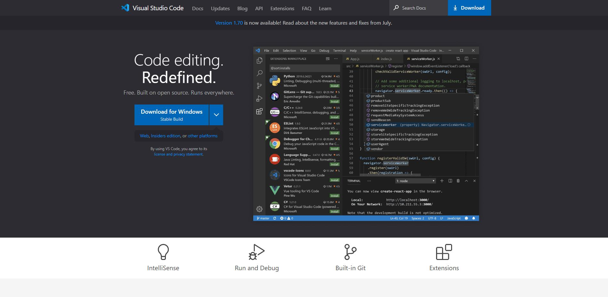
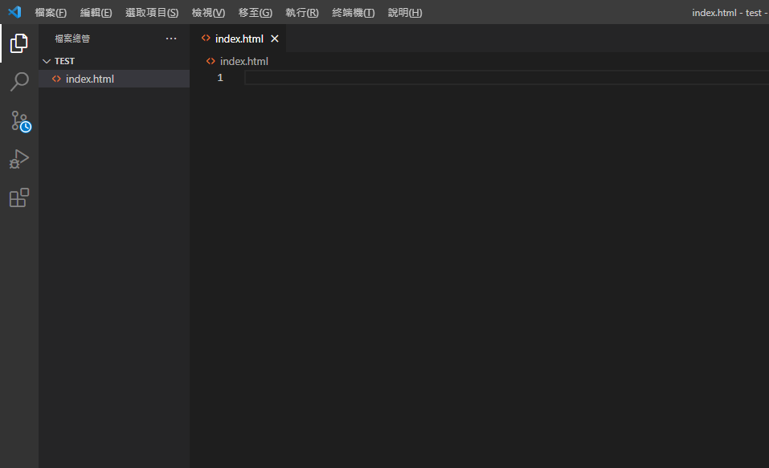

# 執行環境(Execution Context)

現代因為開發上講求效率和方便性，漸漸地越來越多人從Sublime、notepad++、Vim上面轉到Atom、VSCode，而這篇會帶你使用**VSCode**來寫程式。

### Visual Studio Code，簡稱VSCode

<figure><figcaption></figcaption></figure>

一款由**微軟**開發的**免費原始碼編譯器**，此編譯器的程式碼是完全開源，也因為如此有許多開發者加入VSCode的行列，並可以新增許多擴充元件加強軟體功能，讓方便性大增。

### 下載

可以直接進入[官網](https://code.visualstudio.com/)，或搜尋VSCode。

<figure><figcaption></figcaption></figure>

官網會依據你的作業系統給你適合的下載連結，比如我是Windows，所以出現Download for Windows。

點擊**Download**即可。

### 安裝

下載好之後會出現安裝檔，點擊安裝檔。

<figure><figcaption></figcaption></figure>

勾選**我同意**，並一直點擊**下一步**就可以了。

### 開啟

<figure><figcaption></figcaption></figure>

安裝好後開啟VSCode，點選左側最下方的延伸模組。

<figure><figcaption></figcaption></figure>

搜尋chinese，選擇中文(繁體)。

<figure><figcaption></figcaption></figure>

點擊安裝，安裝好後重開VSCode。

另外除了Chinese建議安裝：Live Server。
